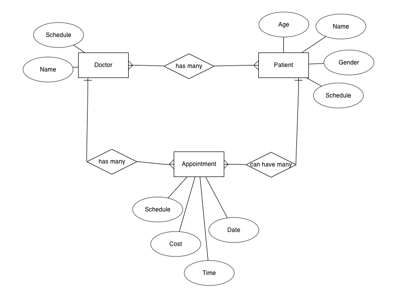

# Hospital Appointment Tracker

# Steps to do to replicate
* yarn or npm install all dependencies
* to add csv file to mongodb and delete code after

## To add csv file to json to mongodb
```
const mongodb = require('mongodb').MongoClient;
const csvtojson = require("csvtojson")

csvtojson()
    .fromFile("appt.csv")
    .then(csvData => {
        console.log(csvData);

        mongodb.connect(
            process.env.MONGO_URL,
            { useNewUrlParser: true, useUnifiedTopology: true },
            (err, client) => {
                if (err) throw err;

                client
                    .db("hospital")
                    .collection("appointments")
                    .insertMany(csvData, (err, res) => {
                        if (err) throw err;

                        console.log(`Inserted: ${res.insertedCount} rows`);
                        client.close();
                    });
            }
        );
    });
```
